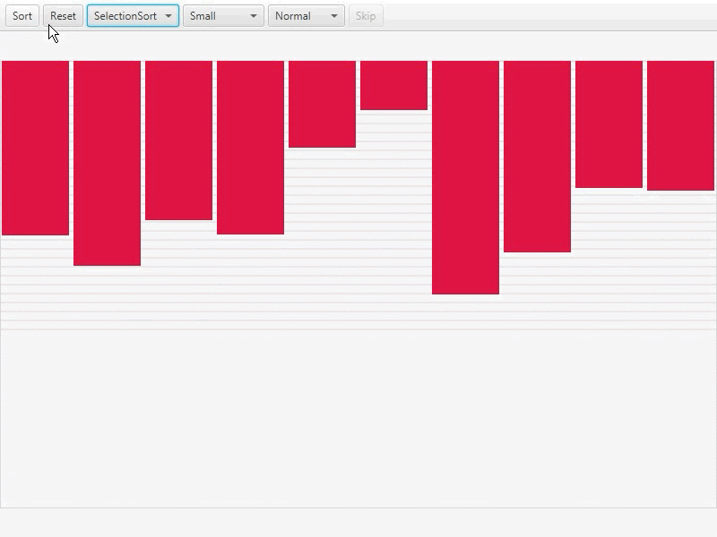

Sorting Visualizer
==============================================
### Description

### Requirements
* Java SDK 17.0.1

### Screenshots
#### BubbleSort
 

#### SelectionSort

#### MergeSort

#### QuickSort

#### InsertionSort

#### HeapSort

